# Informe7

## PRÁCTICA No. 7 INDUCTOR Y CAPACITOR

1. OBJETIVOS

1.1 OBJETIVO GENERAL
* Estudiar los circuitos RC y RL, verificar la relación que tienen los voltajes medidos con el multímetro y el osciloscopio utilizando una fuente de voltaje alterno. Mediante el uso de un simulador de circuitos electrónicos. Escribir los datos adquiridos en tablas y posteriormente analizar los resultados de acuerdo a la teoría vista en clases.

1.2 OBJETIVOS ESPECIFICOS
* Analizar circuitos mediante superposición
* Comparar resultados simulados y calculados
* Verificar el comportamiento de la bobina y el capacitor en circuitos DC.
* Verificar el comportamiento de la bobina y el capacitor en circuitos AC. 
* Verificar las combinaciones serie y paralelo de bobinas y capacitores.
* Familiarizarse con el uso de instrumentos de medida.

2. INFORMACION GENERAL

Los simuladores de circuitos electrónicos son muy útiles para explicar el comportamiento de éstos de una forma asequible a los alumnos de la rama de Eléctrica y Electrónica. El uso de la simulación por ordenador es una herramienta imprescindible hoy en día a la hora de explicar la electrónica en el aula, al ser la forma más sencilla y rápida de comprobar el funcionamiento de un circuito. Además, no necesita ningún tipo de material adicional para el montaje del mismo o medida de los resultados.

MARCO TEÓRICO

3. MATERIAL Y EQUIPO REQUERIDO

| Material o Equipo | 
| --------- | 
| Generador de señales|
| Fuente DC. |
| Osciloscopio. |
| Protoboard |
| Multímetro |
| Cables conductores |
| Resistencias, bobinas y capacitores. |

4. PROCEDIMIENTO

7.1 Construya en el protoboard el circuito mostrado en la Figura 1.

a. Utilice el osciloscopio para observar el voltaje variando la frecuencia entre los valores de 0, 10, 50, 100, 500, 1000 . Anote los valores pico de las ondas observadas.

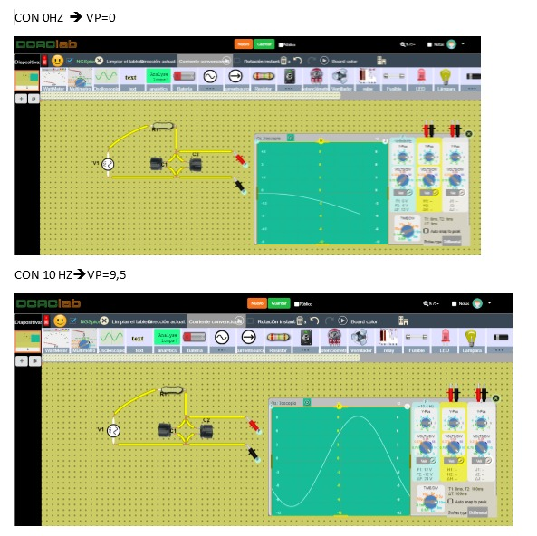

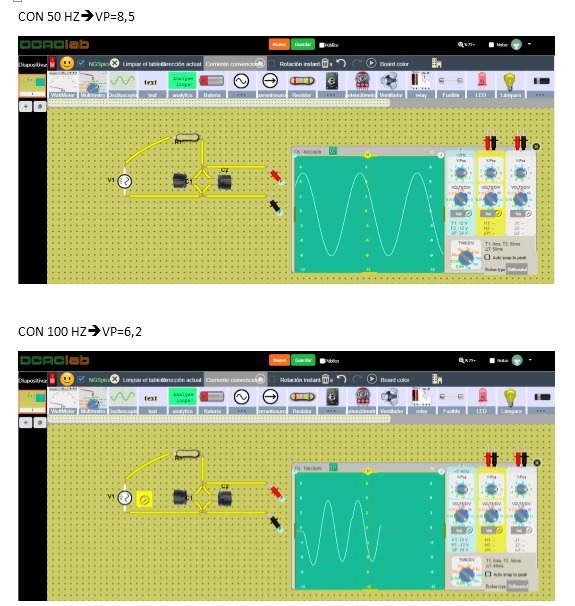

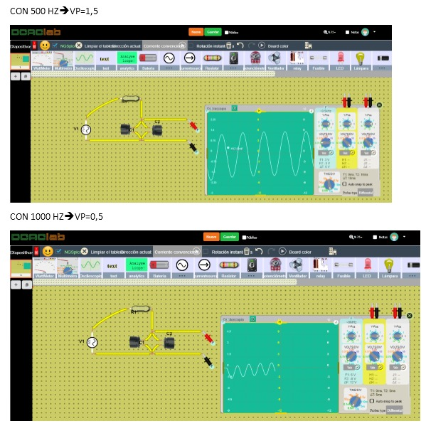

b. Utilice un multímetro para medir el voltaje variando la frecuencia entre los valores de 0, 10, 50, 100, 500, 1000 . Anote los resultados.

c. Utilice un multímetro para medir la corriente que atraviesa la resistencia variando la frecuencia entre los valores 0, 10, 50, 100, 500, 1000 . Anote los resultados.

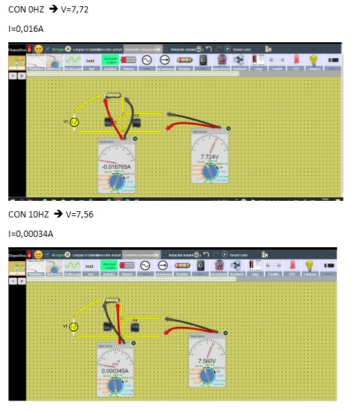

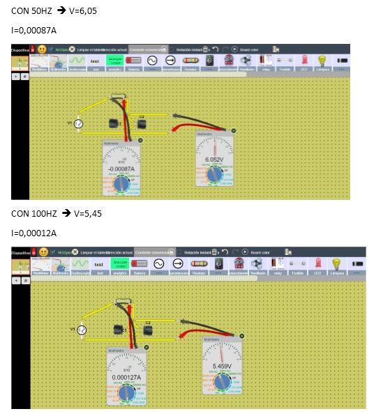

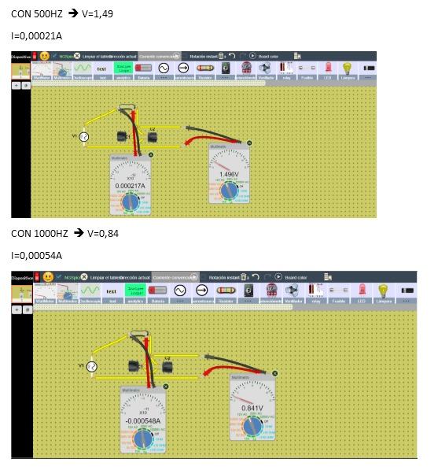

7.2 Construya el circuito mostrado en la Figura 2

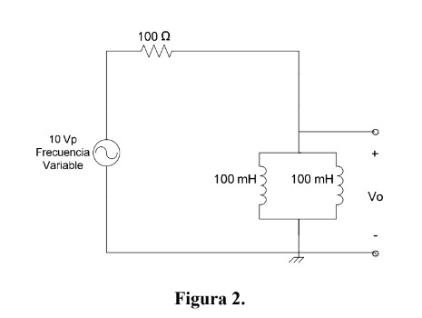

Realice las mismas mediciones de los ítems del numeral anterior y presente los resultados.

a. Utilice el osciloscopio para observar el voltaje variando la frecuencia entre los valores de 0, 10, 50, 100, 500, 1000 . Anote los valores pico de las ondas observadas.

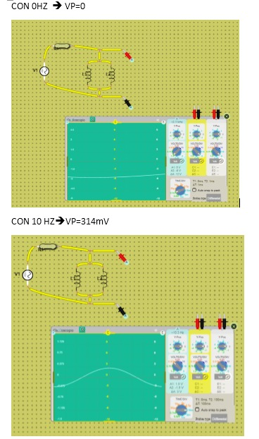

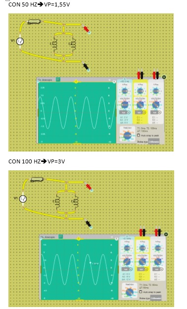

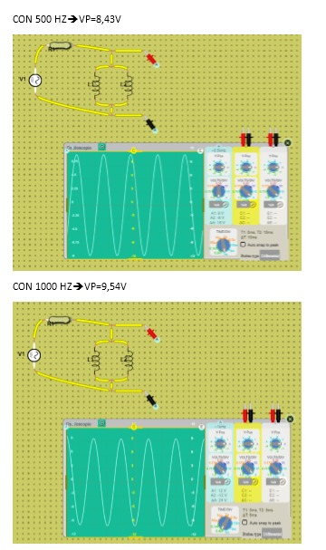

b. Utilice un multímetro para medir el voltaje variando la frecuencia entre los valores de 0, 10, 50, 100, 500, 1000 . Anote los resultados.

c. Utilice un multímetro para medir la corriente que atraviesa la resistencia variando la frecuencia entre los valores 0, 10, 50, 100, 500, 1000 . Anote los resultados.

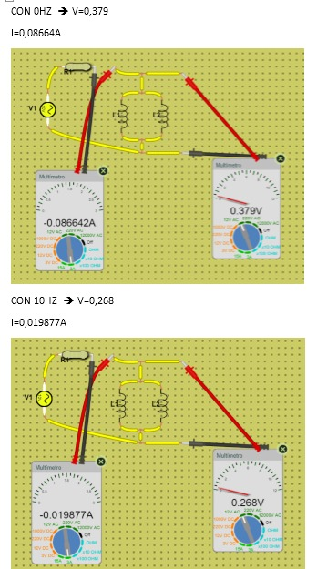
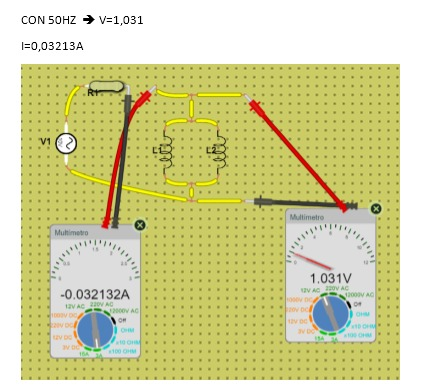
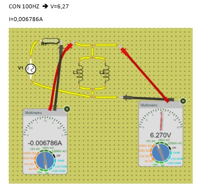
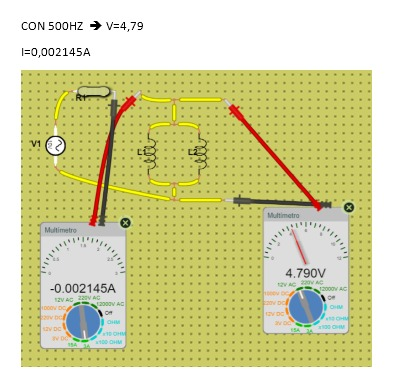
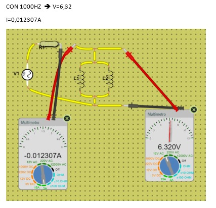

7.3 Análisis de resultados

Para cada uno de los circuitos anteriores, elabore una tabla con los resultados de las diferentes mediciones de voltaje realizadas con el osciloscopio y multímetro. Compare y comente los resultados obtenidos tomando en cuenta las distintas frecuencias utilizadas.

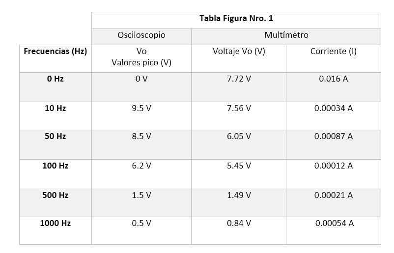

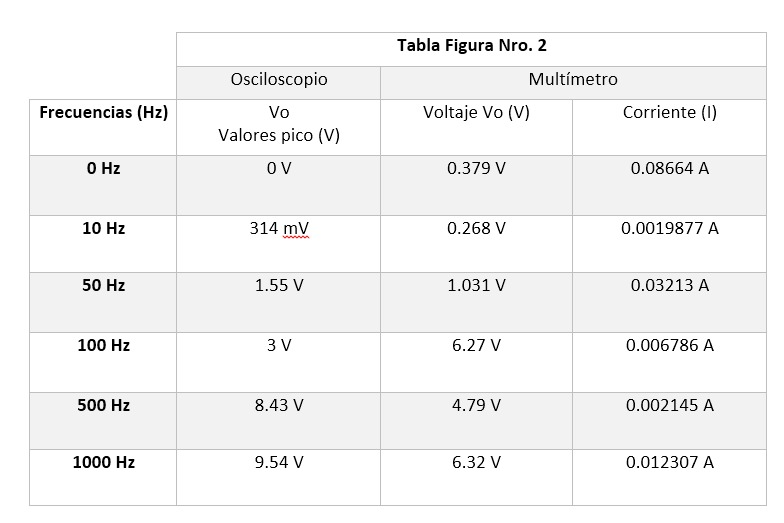

7.8 Preguntas

1.- ¿Cómo se comportan la bobina y el capacitor en corriente continua (cero Hz)

• Los capacitores en un circuito de corriente continua pasan por dos fases conocidas como fase de transición y fase de continua. En la fase de estabilización, se producen los fenómenos que se describen en las curvas de carga del capacitor hasta que se estabiliza y pasa a estar en fase continua, en esta fase la intensidad de corriente que atravesaría el capacitor es igual a cero entonces se lo toma como una “rama abierta” en el circuito.

• En los inductores al ser la corriente constante la caída de tensión sobre ellos es igual a cero, por lo que lo interpretamos como simplemente un “cable” en el circuito.

2.- ¿Cómo se comportan la bobina y el capacitor en corriente alterna?

• En corriente alterna la capacitancia se comporta de forma distinta que, con la corriente continua, mientras en esta los condensadores se tratan como circuitos abiertos cuando se cargan y no dejan circular la corriente, en alterna no ocurre esto, sino que se tratan como si fueran circuitos cerrados.

• Una bobina en una corriente alterna, introduce una oposición denominada reactancia inductiva “XL” la misma que es directamente proporcional al coeficiente de autoinducción (L), cuyo valor se mide en henrios (H), y a la pulsación de la corriente. El ángulo de fase de la bobina en corriente alterna es de 90°. Al permanecer constante la tensión en los extremos de la bobina, no tienen lugar en ella fenómenos de autoinducción y en consecuencia se comporta como un cortocircuito.

3.- ¿Qué cree usted que ocurriría con el voltaje Vo y la corriente de la resistencia en los circuitos analizados en esta práctica, si se utilizan dos bobinas o dos capacitores de valores distintos?

Lo único que pasaría en que los valores Vo varíen en función de que tanto se altere el valor de la impedancia. Si la impedancia capacitiva o resistiva resulta ser menor, la caída de tensión en Vo sería menor y si resulta mayor, la caída de tensión en Vo sería mucho mayor.

4.- ¿Qué son los valores eficaces de voltaje y corriente?

Los valores eficaces de corriente y voltaje son aquellos valores equivalentes en corriente continua es decir tendrá el mismo comportamiento respecto a potencia suministrada en el circuito.

5. VIDEO

6. CONCLUSIONES

• AL observar los valores de la tablas se puede determinar que los valores pico, voltaje rms y la corriente son 0 cuando la frecuencia de la fuente de voltaje tiene un valor de 0, esto se debe al comportamiento de reactancias y capacitancia en corriente directa.

• Es posible representar la impedancia para cada una de las frecuencias asociadas en los dos circuitos como un número complejo donde predomina en un caso la impedancia capacitiva y en el otro caso la impedancia inductiva Z =R +j(Xl - Xc).

• Utilizar la impedancia Z nos permite realizar cálculos utilizando la ley de ohm para los cálculos.

• El valor de la caída de tensión medida con el multímetro corresponde al valor eficaz de la caída de tensión media con el osciloscopio.

• Mientras mayor sea la frecuencia la impedancia capacitiva será menor.  Mientras mayor sea la frecuencia la impedancia inductiva será mayor.

7. BIBLIOGRAFIA

* Universidad de los Andes. (2015). Capacitancia e Inductancia [online]Available at: http://wwwprof.uniandes.edu.co/~antsala/cursos/FDC/Contenidos/07_Inductancia_y_Capacitancia.pdf[Accessed 2Jul. 2017]

* Sadiku, A. Fundamentos de Circuitos Eléctricos, 5ta edición. Capítulo 11, sección 11.4: "Valor eficaz o rms".

• Floyd Thomas L, “Principios de Circuitos Eléctricos”, 8 ed. 2007 .Pearson Educación de México, S.A. de C.V. México, pp. 281-333.

• .Cazar, M. (2019, 18 febrero). Comportamiento de una bobina en corriente continua y en corriente alterna. Prezi.Com. https://prezi.com/p/ofvyyubqitlz/comportamiento-de-una-bobina-en-corriente-continua-y-en-corriente-alterna/?frame=d00d5b29b8e7fd597b45960609c0e460377e46ea

*Bobinas [Witronica]. (2019, 25 enero). Witronica. http://witronica.com/componentes:bobina

• Morales, J. A. R. (2020, 31 agosto). Funcionamiento del condensador. PASIÓN ELECTRÓNICA. https://pasionelectronica.com/funcionamiento-del-condensador/
